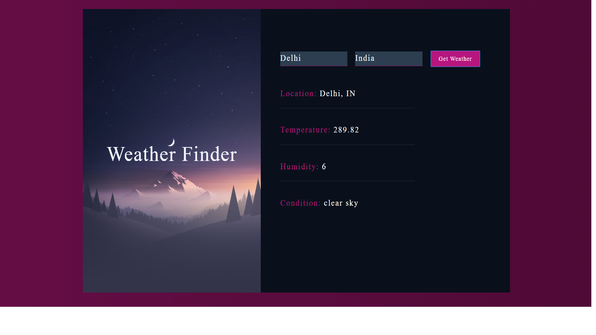

# react-weather-app

Simple weather app coded in react.js
You can also find the UI of the app [here](https://uditiarora.github.io/react-weather-app/). The app will not work bcoz gh-pages only supports static content. This is only to get a feel of the UI.

## Screenshot


## Run it locally
1. Clone the repo
	
   ```sh
   git clone https://github.com/uditiarora/react-weather-app.git
	```
2. Install dependencies

   ```sh
	npm install
	```
3. Run 
	
   ```sh
	npm run start
	```
4. Go to localhost:3000